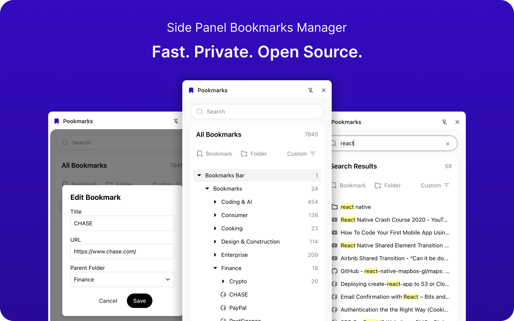

# Pookmarks: Chrome Bookmarks Manager

A fast, free, private, open source Chrome Side Panel Extension for managing your bookmarks.

Looks like (and works like) a file explorer from a code editor, but for your bookmarks.

It's a wrapper around the Chrome Extension API, so it edits your browser's bookmarks in the same way as if you were using the Chrome bookmarks manager.

The result is that the extension is private and runs entirely locally on your machine. It doesn't log your usage or data to any other servers. However, you can still sync your bookmarks across devices using Chrome's built-in sync feature.

## Tech Stack

- React
- TypeScript
- Chrome Extension API
- Vite
- Radix UI

## Features

- [x] View all bookmarks (nested tree structure of folders and bookmarks like a file explorer)
- [x] Add a bookmark
- [x] Edit a bookmark
- [x] Remove a bookmark
- [x] Add a folder
- [x] Edit a folder
- [x] Remove a folder
- [x] Search for a bookmark or folder by title or url
- [x] Drag and drop to reorder bookmarks or folders in the tree structure
- [x] Light mode and dark mode
- [x] Sort bookmarks by title or date added
- [x] Add keyboard navigation

## TODO

- [x] Improve editing bookmark dialog styles (light/dark themes)
  - [x] Fix select dropdown styling (light/dark themes)
  - [x] Fix height of select dropdown in edit bookmark dialog
- [x] Prevent editing top level folders (Bookmarks Bar and Other Bookmarks)
- [x] Update context menu options for folders
  - [x] Hide "Open in New Tab", "Open in New Window"
  - [x] Rename "Edit" to "Rename"
  - [x] Add "Open All (<count>)", "Open All (<count>) in New Window", "Open All (<count>) in New Tab Group"
- [x] When clicking on a folder in the search results, clear the search input and open the folder in the tree structure
- [x] Make top part sticky, or only bottom part with overflow scroll
- [x] Add new bookmark action button (pre-fill url and title based on current tab, leave folder blank)
- [x] Add new folder action button (completely empty form)
- [x] Fix drag and drop glitch (when dropping a bookmark into a position lower down on the list, it first gets inserted one item lower than intended, then quickly resolves to move to the correct position)
- [x] Add icons
- [x] Add gradients at the top and bottom of the list to indicate there are more items to scroll through and not cut them off harshly
- [x] Optional: Fix drag and drop glitch when dragging a open folder, it resizes to the height of a single bookmark or collapsed folder item, but the reference element that shifts the list items is still the same size as the expanded folder
- [x] Optional: Make drag and drop between folders possible
- [x] Optional: Check to see if the browser is in light mode or dark mode and use the appropriate theme
- [x] Optional: Add multilingual support (English, Spanish, French, German, Italian, Portuguese)
- [x] Optional: Add more languages (Dutch, Swedish, Norwegian, Danish, Finnish, Greek)
- [x] Optional: Add even more languages (Polish, Czech, Slovak, Hungarian, Croatian, Slovenian, Estonian, Latvian, Lithuanian)
- [x] Optional: Add even even more languages (Chinese, Japanese, Korean, Russian, Turkish)
- [x] Optional: Fix bug where tab focused action buttons can't be triggered by using enter key because the selected item on the tree or flat list will be triggered instead.
- [x] Optional: Fix bug where the context menu is partially hidden or cut off because of its placement. Make sure it's always visible and doesn't get cut off.

## Installing locally

1. Clone the repository
2. Open the project directory (in your editor or terminal)
3. Run `npm install` or `pnpm install`
4. Run `npm run build` or `pnpm run build`
5. In Chrome, go to `chrome://extensions/`
6. Enable "Developer mode"
7. Click "Load unpacked"
8. Select the `dist` folder (the folder that was created when you ran `npm run build` or `pnpm run build`)
